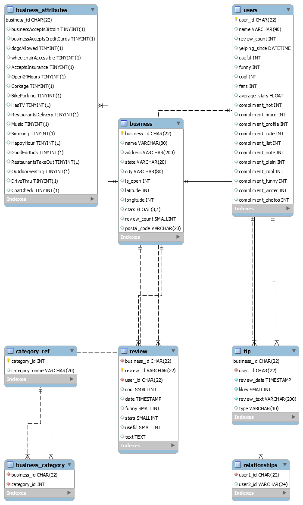

[](https://GitHub.com/Naereen/ama)
[](https://www.python.org/)


# Analyzing the Yelp Challenge Data Set
This project begins with the unstructured JSON files of the yelp data set, which includes user data and several million reviews, and proceeds through the creation of a structured database using python connectors and SQL, and subsequent visualization, analysis, and machine learning exploration of the data. The dashboard resulting from this project can be found here:

http://yelp-dashboard.eba-jpaf3bhg.us-east-2.elasticbeanstalk.com/

The repo for this dashboard is [here](https://github.com/tyarosevich/yelp_data_analysis) on github.

# Motivation
This project's sole purpose is to display familiarity with the technology and methods intrinsic to Data Scientist and Data Analyst roles.

# Framework
Python - 3.8
numpy - 1.19.2 
Scikit-Learn - 0.23.2
keras - 2.4.3
MySQL - 8.0
sqlalchemy 1.3.19
NLTK - 3.5

# Figure Samples


# Code Sample
```
#%% Build the business_attribute dataframe

df_business_attributes = pd.DataFrame()
for attribute in key_list:
    df_business_attributes[attribute] = [x[attribute] if attribute in x else False for x in attribute_list_noempty]

# Convert string booleans to boolean type.
for c in df_business_attributes.columns:
    df_business_attributes[c] = [x=="True" if type(x) == str else x for x in df_business_attributes[c]]

